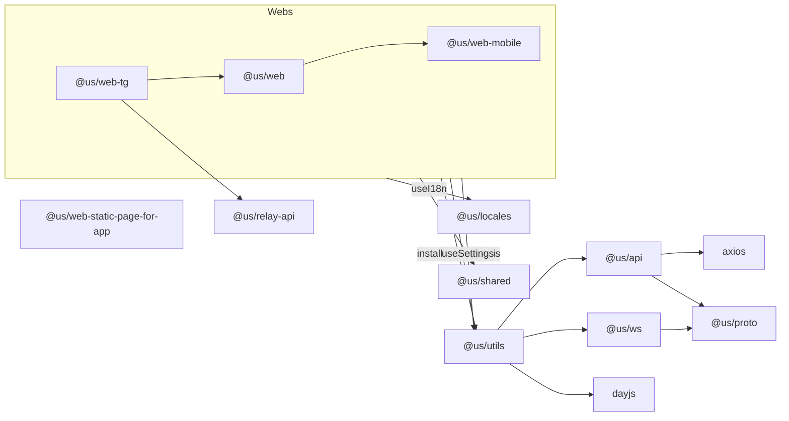

[[_TOC_]]
## 專案 Script 說明 - 已敘述於 package.json
>>>
    setup: 一次安裝所有專案套件
    web-dev: 開啟web 專案dev環境
    web-dev-mobile: 開啟web-mobile 專案dev環境
    web-stg: 開啟web 專案stg環境
    web-stg-mobile: 開啟web-mobile 專案stg環境
    web-dev-tg: 開啟web-tg 專案dev環境
    web-stg-tg: 開啟web-tg 專案stg環境
    web-dev-app: 開啟web-static-page-for-app 專案dev環境
    web-build-dev: 打包web 專案dev環境
    web-build-stg: 打包web 專案stg環境
    web-build-prod: 打包web 專案prod環境
    web-build-tg-dev: 打包web-tg 專案dev環境
    web-build-tg-stg: 打包web-tg 專案stg環境
    web-build-tg-prod: 打包web-tg 專案prod環境
    web-build-app-dev: 打包web-static-page-for-app  專案dev環境
    web-build-app-stg: 打包web-static-page-for-app  專案stg環境
    web-build-app-prod: 打包web-static-page-for-app  專案prod環境
    protoc2ts: 將packages/proto檔案轉成ts檔
    locales-update: 更新googleSheet轉i18n json檔 
>>>

## 佈署web-tg專案
- stg環境

開分支release/tg開頭的分支push即可觸發stg佈署流程

ex:release/tg_v1.0.0
- prod環境

打tag tg開頭的tag即可觸發prod佈署流程

ex:tg_v1.0.0

## 佈署us web專案
- stg環境

開分支release/開頭的分支push即可觸發stg佈署流程

ex:開分支release/v1.0.0
- prod環境

打tag即可觸發prod佈署流程

ex:v1.0.0

## 佈署web-static-page-for-app專案
- stg環境

開分支release/app開頭的分支push即可觸發stg佈署流程

ex:release/app_v1.0.0
- prod環境

打tag app開頭的tag即可觸發prod佈署流程

ex:app_v1.0.0

## 開發環境

- Node: Latest LTS

[![](data:image/svg+xml;base64,PHN2ZyBpZD0iTGF5ZXJfMSIgeG1sbnM9Imh0dHA6Ly93d3cudzMub3JnLzIwMDAvc3ZnIiB2aWV3Qm94PSIwIDAgMTE1NC44IDUxOCI+PHN0eWxlPi5zdDB7ZmlsbDojMmM4ZWJifS5zdDF7ZmlsbDojZmZmfTwvc3R5bGU+PHBhdGggY2xhc3M9InN0MCIgZD0iTTcxOC42IDI1Ny44Yy04IDI3LjYtMjAuOCA0Ny42LTM1LjIgNjMuNlYxODFjMC05LjYtOC40LTE3LjYtMjEuNi0xNy42LTUuNiAwLTEwLjQgMi44LTEwLjQgNi44IDAgMi44IDEuNiA1LjIgMS42IDEyLjh2NjQuNGMtNC44IDI4LTE2LjggNTQtMzIuOCA1NC0xMS42IDAtMTguNC0xMS42LTE4LjQtMzMuMiAwLTMzLjYgNC40LTUxLjIgMTEuNi04MC44IDEuNi02IDEzLjItMjItNi40LTIyLTIxLjIgMC0xOC40IDgtMjEuMiAxNC44IDAgMC0xMy40IDQ3LjYtMTMuNCA5MCAwIDM0LjggMTQuNiA1Ny42IDQxLjQgNTcuNiAxNy4yIDAgMjkuNi0xMS42IDM5LjItMjcuNlYzNTFjLTI2LjQgMjMuMi00OS42IDQzLjYtNDkuNiA4NCAwIDI1LjYgMTYgNDYgMzguNCA0NiAyMC40IDAgNDEuNi0xNC44IDQxLjYtNTYuOFYzNTVjMjEuNi0xOC44IDQ0LjgtNDIuNCA1OC40LTg4LjguNC0xLjYuNC0zLjYuNC00IDAtNy42LTcuNi0xNi40LTE0LTE2LjQtNCAwLTcuMiAzLjYtOS42IDEyem0tNzYuOCAxOThjLTYuNCAwLTEwLjQtOS42LTEwLjQtMjIgMC0yNCA4LjgtMzkuMiAyMS42LTUyLjR2NDIuOGMwIDcuNiAxLjYgMzEuNi0xMS4yIDMxLjZ6Ii8+PHBhdGggY2xhc3M9InN0MCIgZD0iTTgzMy40IDMwMWMtOS42IDAtMTMuNi05LjYtMTMuNi0xOC40di02NmMwLTkuNi04LjQtMTcuNi0yMS42LTE3LjYtNS42IDAtMTAuNCAyLjgtMTAuNCA2LjggMCAyLjggMS42IDUuMiAxLjYgMTIuOHY2MS42Qzc4NSAyOTEuNCA3NzcuOCAzMDEgNzY3IDMwMWMtMTQgMC0yMi44LTEyLTIyLjgtMzIuOCAwLTU3LjYgMzUuNi04My42IDY2LTgzLjYgNCAwIDggLjggMTEuNi44IDQgMCA1LjItMi40IDUuMi05LjIgMC0xMC40LTcuNi0xNi44LTE4LjQtMTYuOC00OC44IDAtOTUuMiA0MC44LTk1LjIgMTA3LjYgMCAzNCAxNi40IDYwLjQgNDcuNiA2MC40IDE1LjIgMCAyNi40LTcuMiAzNC40LTE2LjQgNiA5LjYgMTYuOCAxNi40IDMwLjggMTYuNCAzNC40IDAgNTAuNC0zNiA1Ny4yLTYyLjQuNC0xLjYuNC0yLjQuNC0yLjggMC03LjYtNy42LTE2LjQtMTQtMTYuNC00IDAtOCAzLjYtOS42IDEyLTMuNiAxNy42LTEwLjggNDMuMi0yNi44IDQzLjJ6Ii8+PHBhdGggY2xhc3M9InN0MCIgZD0iTTk0OSAzMjcuNGMzNC40IDAgNTAtMzYgNTcuMi02Mi40IDAtLjguNC0xLjYuNC0yLjggMC03LjYtNy42LTE2LjQtMTQtMTYuNC00IDAtOCAzLjYtOS42IDEyLTMuNiAxNy42LTEwLjQgNDMuMi0yOC44IDQzLjItMTAuOCAwLTE2LTEwLjQtMTYtMjEuNiAwLTQwIDE4LTg3LjIgMTgtOTIgMS42LTkuMi0xNC40LTIyLjQtMTkuMi0yMi40aC0yMC44Yy00IDAtOCAwLTIxLjItMS42LTQuNC0xNi40LTE1LjYtMjEuMi0yNS4yLTIxLjItMTAuNCAwLTIwIDcuMi0yMCAxOC40IDAgMTEuNiA3LjIgMjAgMTcuMiAyNS42LS40IDIwLjQtMiA1My42LTYuNCA2OS42LTMuNiAxMy42IDE3LjIgMjggMjIuNCAxMS4yIDcuMi0yMy4yIDkuNi01OCAxMC03My42aDM0LjhjLTEyLjggMzQuNC0yMCA2Mi44LTIwIDg4LjQgMCAzNS4yIDIyLjQgNDUuNiA0MS4yIDQ1LjZ6Ii8+PHBhdGggY2xhc3M9InN0MCIgZD0iTTk4NC42IDMwOS44YzAgMTQuOCAxMS4yIDE3LjYgMTkuMiAxNy42IDExLjYgMCAxMS4yLTkuNiAxMS4yLTE3LjJ2LTU4LjRjMi44LTMxLjYgMjcuNi02NiAzOS4yLTY2IDcuNiAwIDguNCAxMC40IDguNCAyMi44djgxLjJjMCAyMC40IDEyLjQgMzcuNiAzMy42IDM3LjYgMzQuNCAwIDUxLjQtMzYgNTguMi02Mi40LjQtMS42LjQtMi40LjQtMi44IDAtNy42LTcuNi0xNi40LTE0LTE2LjQtNCAwLTggMy42LTkuNiAxMi0zLjYgMTcuNi0xMS44IDQzLjItMjcuOCA0My4yLTEwLjQgMC0xMC40LTE0LjgtMTAuNC0xOC40di04Mi44YzAtMTguNC02LjQtNDAuNC0zMy4yLTQwLjQtMTkuNiAwLTM0IDE3LjItNDQuOCAzOS42di0xOGMwLTkuNi04LjQtMTcuNi0yMS42LTE3LjYtNS42IDAtMTAuNCAyLjgtMTAuNCA2LjggMCAyLjggMS42IDUuMiAxLjYgMTIuOHYxMjYuOHpNMjU5IDBjMTQzIDAgMjU5IDExNiAyNTkgMjU5UzQwMiA1MTggMjU5IDUxOCAwIDQwMiAwIDI1OSAxMTYgMCAyNTkgMHoiLz48cGF0aCBjbGFzcz0ic3QxIiBkPSJNNDM1LjIgMzM3LjVjLTEuOC0xNC4yLTEzLjgtMjQtMjkuMi0yMy44LTIzIC4zLTQyLjMgMTIuMi01NS4xIDIwLjEtNSAzLjEtOS4zIDUuNC0xMyA3LjEuOC0xMS42LjEtMjYuOC01LjktNDMuNS03LjMtMjAtMTcuMS0zMi4zLTI0LjEtMzkuNCA4LjEtMTEuOCAxOS4yLTI5IDI0LjQtNTUuNiA0LjUtMjIuNyAzLjEtNTgtNy4yLTc3LjgtMi4xLTQtNS42LTYuOS0xMC04LjEtMS44LS41LTUuMi0xLjUtMTEuOS40QzI5My4xIDk2IDI4OS42IDkzLjggMjg2LjkgOTJjLTUuNi0zLjYtMTIuMi00LjQtMTguNC0yLjEtOC4zIDMtMTUuNCAxMS0yMi4xIDI1LjItMSAyLjEtMS45IDQuMS0yLjcgNi4xLTEyLjcuOS0zMi43IDUuNS00OS42IDIzLjgtMi4xIDIuMy02LjIgNC0xMC41IDUuNmguMWMtOC44IDMuMS0xMi44IDEwLjMtMTcuNyAyMy4zLTYuOCAxOC4yLjIgMzYuMSA3LjEgNDcuNy05LjQgOC40LTIxLjkgMjEuOC0yOC41IDM3LjUtOC4yIDE5LjQtOS4xIDM4LjQtOC44IDQ4LjctNyA3LjQtMTcuOCAyMS4zLTE5IDM2LjktMS42IDIxLjggNi4zIDM2LjYgOS44IDQyIDEgMS42IDIuMSAyLjkgMy4zIDQuMi0uNCAyLjctLjUgNS42LjEgOC42IDEuMyA3IDUuNyAxMi43IDEyLjQgMTYuMyAxMy4yIDcgMzEuNiAxMCA0NS44IDIuOSA1LjEgNS40IDE0LjQgMTAuNiAzMS4zIDEwLjZoMWM0LjMgMCA1OC45LTIuOSA3NC44LTYuOCA3LjEtMS43IDEyLTQuNyAxNS4yLTcuNCAxMC4yLTMuMiAzOC40LTEyLjggNjUtMzAgMTguOC0xMi4yIDI1LjMtMTQuOCAzOS4zLTE4LjIgMTMuNi0zLjMgMjIuMS0xNS43IDIwLjQtMjkuNHptLTIzLjggMTQuN2MtMTYgMy44LTI0LjEgNy4zLTQzLjkgMjAuMi0zMC45IDIwLTY0LjcgMjkuMy02NC43IDI5LjNzLTIuOCA0LjItMTAuOSA2LjFjLTE0IDMuNC02Ni43IDYuMy03MS41IDYuNC0xMi45LjEtMjAuOC0zLjMtMjMtOC42LTYuNy0xNiA5LjYtMjMgOS42LTIzcy0zLjYtMi4yLTUuNy00LjJjLTEuOS0xLjktMy45LTUuNy00LjUtNC4zLTIuNSA2LjEtMy44IDIxLTEwLjUgMjcuNy05LjIgOS4zLTI2LjYgNi4yLTM2LjkuOC0xMS4zLTYgLjgtMjAuMS44LTIwLjFzLTYuMSAzLjYtMTEtMy44Yy00LjQtNi44LTguNS0xOC40LTcuNC0zMi43IDEuMi0xNi4zIDE5LjQtMzIuMSAxOS40LTMyLjFzLTMuMi0yNC4xIDcuMy00OC44YzkuNS0yMi41IDM1LjEtNDAuNiAzNS4xLTQwLjZzLTIxLjUtMjMuOC0xMy41LTQ1LjJjNS4yLTE0IDcuMy0xMy45IDktMTQuNSA2LTIuMyAxMS44LTQuOCAxNi4xLTkuNSAyMS41LTIzLjIgNDguOS0xOC44IDQ4LjktMTguOHMxMy0zOS41IDI1LTMxLjhjMy43IDIuNCAxNyAzMiAxNyAzMnMxNC4yLTguMyAxNS44LTUuMmM4LjYgMTYuNyA5LjYgNDguNiA1LjggNjgtNi40IDMyLTIyLjQgNDkuMi0yOC44IDYwLTEuNSAyLjUgMTcuMiAxMC40IDI5IDQzLjEgMTAuOSAyOS45IDEuMiA1NSAyLjkgNTcuOC4zLjUuNC43LjQuN3MxMi41IDEgMzcuNi0xNC41YzEzLjQtOC4zIDI5LjMtMTcuNiA0Ny40LTE3LjggMTcuNS0uMyAxOC40IDIwLjIgNS4yIDIzLjR6Ii8+PC9zdmc+)](https://yarnpkg.com/ "yarn")
- yarn: Latest LTS

## 技術選型

package manage
- [Vue 3](https://cn.vuejs.org/)
    - TypeScript
    - scss
    - Composition API + script setup
- [Vite](https://cn.vitejs.dev/guide/)
- [Monorepo](https://monorepo.tools/)
- yarn

## 項目設置

### 安裝yarn

執行 `$ npm i -g yarn`

### 安裝依賴

執行 `$ yarn` 或 `$ npm run setup`

### IDE設置

+ 安裝 IDE
    + Visual Studio Code: https://code.visualstudio.com/
+ 安裝 VS Code 延伸模組
    + Vue Language Features (Volar): https://marketplace.visualstudio.com/items?itemName=johnsoncodehk.volar  
+ 禁用 VS Code 延伸模組
    + 若無安裝下列清單中的項目則可跳過該步驟
    + 於『延伸模組』區塊中，搜尋下列模組，點選清單項目的齒輪圖樣，操作停用(工作區)進行停用，避免延伸模組衝突。
        + Vetur
+ 禁用 VS Code 內建延伸模組
    1. 開啟『顯示所有命令』
        + 點擊導覽列『說明』，點選『顯示所有命令』
        + macOS快捷鍵 -> 「command」+「shift」+「P」
    2. 輸入 「built」 
    3. 點選『延伸模組:顯示內建延伸模組』
    4. 搜尋下列模組，點選清單項目的齒輪圖樣，操作停用(工作區)進行停用，避免延伸模組衝突。
        + TypeScript and JavaScript Language Features(TypeScript 和 JavaScript 語言功能)

## 運行Dev server
+ 由於使用 Monorepo 需要至相對應的資料夾下使用 Terminal command line 指令起 Dev Server  
    + US: `$ cd packages/web && npm run dev`
    + US Mobile: `$ cd packages/web-mobile && npm run dev`
    + TG: `$ cd packages/web-tg && npm run dev`
+ 也可透過 npm 執行已敘述在 package.json 的 Script 起 Dev Server  
    + US: `$ npm run web-dev`
    + US Mobile: `$ npm run web-dev-mobile`
    + TG: `$ npm run web-dev-tg`  
  
## 項目組織
  

## 相關網址
  US網址
- dev	sportsdev.us8000.com
- stg	w1.us8000.com
- prod	usvip888.com

直播聊天室
- dev	livedev.k33uc.com
- stg	 2021euh5live.k33uc.com
- prod  live.youhao1.cn

TG
- stg-pc    https://xxxxxx
- stg-mobile    https://xxxxxx

智能下單(方便直播聊天室拿token，不透過TG還要開vpn)
- stg	http://xxxxxx/fake/

api-文檔
- relay-api-dev https://xxxxxx/api/documentation
- relay-api-stg https://xxxxxx/api/documentation
- us-api https://xxxxxx/api/documentation

多語系
- TG多語系 	https://docs.google.com/spreadsheets/d/
- US 多語系	https://docs.google.com/spreadsheets/d/